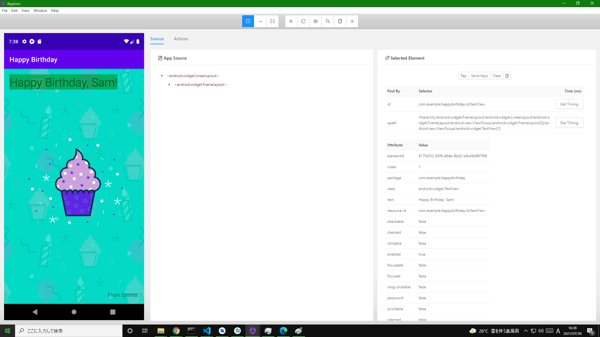

# Appium による E2E テスト

## 環境構築（ローカル）

appium-doctor で NG が出たのでその部分の環境構築

```shell
> appium-doctor

info AppiumDoctor Appium Doctor v.1.16.0
info AppiumDoctor ### Diagnostic for necessary dependencies starting ###
info AppiumDoctor  ✔ The Node.js binary was found at: C:\Program Files\nodejs\node.EXE
info AppiumDoctor  ✔ Node version is 14.16.0
WARN AppiumDoctor  ✖ ANDROID_HOME environment variable is NOT set!
WARN AppiumDoctor  ✖ JAVA_HOME environment variable is NOT set!
WARN AppiumDoctor  ✖ adb, android, emulator could not be found because ANDROID_HOME or ANDROID_SDK_ROOT is NOT set!
WARN AppiumDoctor  ✖ Cannot check %JAVA_HOME% requirements since the environment variable itself is not set
info AppiumDoctor ### Diagnostic for necessary dependencies completed, 4 fixes needed. ###
```

### JAVA_HOME にパスを通す

https://adoptopenjdk.net/ から openjdk11 をインストール<br>
※インストールの際、カスタムセットアップの画面で`Set JAVA_HOME variable`がデフォルトだと`×インストールしない`になっているので、`ローカルハードドライブにインストール`に変更する

インストール完了後、`javac --version`とコマンドプロンプトで実行しバージョンが表示されれば OK<br>
（バージョンが表示されない時は再起動して JAVA＿HOME のパスが windows に通るようにする）

上記実行後の`appium-doctor`の実行結果が以下。

```shell
info AppiumDoctor Appium Doctor v.1.16.0
info AppiumDoctor ### Diagnostic for necessary dependencies starting ###
info AppiumDoctor  ✔ The Node.js binary was found at: C:\Program Files\nodejs\node.EXE
info AppiumDoctor  ✔ Node version is 14.16.0
WARN AppiumDoctor  ✖ ANDROID_HOME environment variable is NOT set!
info AppiumDoctor  ✔ JAVA_HOME is set to: C:\Program Files\AdoptOpenJDK\jdk-11.0.11.9-hotspot\
WARN AppiumDoctor  ✖ adb, android, emulator could not be found because ANDROID_HOME or ANDROID_SDK_ROOT is NOT set!
info AppiumDoctor  ✔ 'bin' subfolder exists under 'C:\Program Files\AdoptOpenJDK\jdk-11.0.11.9-hotspot\'
info AppiumDoctor ### Diagnostic for necessary dependencies completed, 2 fixes needed. ###
```

### ANDROID_HOME にパスを通す

Android Studio（＋ SDK Tools）はインストール済みである場合は、その SDK がある場所を windows の環境変数に設定してパスを通す必要がある<br>
`C:\Users\user\AppData\Local\Android\Sdk`に SDK があったのでそれをそれぞれ、

- ANDROID_HOME : C:\Users\user\AppData\Local\Android\Sdk
- Path に以下の順でそれぞれ追加
  - %ANDROID_HOME%emulator
  - %ANDROID_HOME%tools
  - %ANDROID_HOME%platform-tools

※windows のシステム変数が編集できない時は[ここを参照](https://aprico-media.com/posts/5907)

設定完了後に（再起動を忘れずに行って）`appium-doctor`を実行し、上記で ✖ になっていた部分が ✔ になれば OK

```shell
info AppiumDoctor Appium Doctor v.1.16.0
info AppiumDoctor ### Diagnostic for necessary dependencies starting ###
info AppiumDoctor  ✔ The Node.js binary was found at: C:\Program Files\nodejs\node.EXE
info AppiumDoctor  ✔ Node version is 14.16.0
info AppiumDoctor  ✔ ANDROID_HOME is set to: C:\Users\user\AppData\Local\Android\Sdk
info AppiumDoctor  ✔ JAVA_HOME is set to: C:\Program Files\AdoptOpenJDK\jdk-11.0.11.9-hotspot\
info AppiumDoctor    Checking adb, android, emulator
info AppiumDoctor      'adb' is in C:\Users\user\AppData\Local\Android\Sdk\platform-tools\adb.exe
info AppiumDoctor      'android' is in C:\Users\user\AppData\Local\Android\Sdk\tools\android.bat
info AppiumDoctor      'emulator' is in C:\Users\user\AppData\Local\Android\Sdk\emulator\emulator.exe
info AppiumDoctor  ✔ adb, android, emulator exist: C:\Users\user\AppData\Local\Android\Sdk
info AppiumDoctor  ✔ 'bin' subfolder exists under 'C:\Program Files\AdoptOpenJDK\jdk-11.0.11.9-hotspot\'
info AppiumDoctor ### Diagnostic for necessary dependencies completed, no fix needed. ###
```

### emulator コマンドで AVD を起動できるようにする

以下のコマンドで AVD の名前を確認してその名前で AVD をコマンドプロンプトから起動できる<br>
※環境変数にパスが通っている事が前提

```cmd
C:\Users\user>emulator -list-avds
Pixel_3_XL_API_28

C:\Users\user>emulator @Pixel_3_XL_API_28
```

# E2E テスト

webdriverio を用いて appium client から appium server へ接続する部分を実装<br>
https://appium.io/docs/en/about-appium/getting-started/index.html#running-your-first-test<br>
`__e2e__/index.js`

## capabilities

以下を見ると分かる<br>
今回の`index.js`の各キーの値は以下を参考にしている<br>
https://appium.io/docs/en/writing-running-appium/caps/index.html

## Mocha を導入

単純に

```js
// index.js
async function main() {
  const client = await wdio.remote(opts);

  const field = await client.$(
    '//*[@resource-id="com.example.happybirthday:id/textView"]'
  );
  const value = await field.getText();
  assert.strictEqual(value, "Happy Birthday, Sam!");

  await client.deleteSession();
}

main();
```

```
node index.js
```

でテストを実行すると結果も分かりにくいので [mocha](https://github.com/mochajs/mocha) でテストを見やすく実装しやすくする

参考：[INSTALLATION](https://mochajs.org/#installation)<br>
参考：[GETTING STARTED](https://mochajs.org/#getting-started)<br>
参考：[COMMAND-LINE USAGE](https://mochajs.org/#command-line-usage)<br>
参考：[REPORTERS](https://mochajs.org/#reporters)
参考：[Expect](https://github.com/Automattic/expect.js)

## テスト作成方法

node の`inspect`オプション × `debugger`を使い、appium client と appium server のセッションがつながっている状態で一時停止させる<br>
その後、appium desktop を起動し `File > New Session Window... > Attach to Session...タブ > Attach to Sessionボタン` で以下のような画面が表示されるので、ここからロケータを取得する


（Appium Desktop はかなり重いので画面が表示されるまでに時間がかかる事が多いので注意）

※この時のポイントとしては、

- newCommandTimeout: 300 など長い時間に設定する<br>デフォルトでは 60（60 秒） になっているので、デバッグポイントで一時停止させた後、何も操作をしない（client から server にコマンドを送信しない）と 60 秒で session が切れてしまうため
- --no-timeout に設定する<br>デフォルトでは 2s になっているので、`mocha inspect --no-timeout`のように timeout しないようにしてからテスト実行しないと、appium desktop でロケータ情報などを取得している最中にデバッグが終了してしまう

のようにする事

## 課題

- ~~mocha でテスト実行した時に、mocha の結果と webdriver の log がごっちゃになる~~<br>webdriverio の log を`outputDir`オプションでディレクトリに出力するようにする<br>参考：[outputDir](https://webdriver.io/docs/options/#outputdir)

```
> e2e@1.0.0 s:test C:\Users\user\AndroidStudioProjects\HappyBirthday\__e2e__
> mocha --timeout 20s


  Happy Birthday App Test
2021-07-30T07:32:27.849Z INFO webdriver: Initiate new session using the WebDriver protocol
2021-07-30T07:32:27.981Z INFO webdriver: [POST] http://127.0.0.1:4723/wd/hub/session
2021-07-30T07:32:27.982Z INFO webdriver: DATA {
  capabilities: {
    alwaysMatch: {
      platformName: 'Android',
      platformVersion: '9',
      deviceName: 'Android Emulator',
      app: 'C:\\Users\\user\\AndroidStudioProjects\\HappyBirthday\\app/build/outputs/apk/debug/app-debug.apk',
      automationName: 'UiAutomator2',
      newCommandTimeout: 300
    },
    firstMatch: [ {} ]
  },
  desiredCapabilities: {
    platformName: 'Android',
    platformVersion: '9',
    deviceName: 'Android Emulator',
    app: 'C:\\Users\\user\\AndroidStudioProjects\\HappyBirthday\\app/build/outputs/apk/debug/app-debug.apk',
    automationName: 'UiAutomator2',
    newCommandTimeout: 300
  }
}
2021-07-30T07:32:40.013Z INFO webdriver: COMMAND findElement("xpath", "//android.widget.FrameLayout/android.view.ViewGroup/android.widget.FrameLayout[1]/android.view.ViewGroup/android.widget.TextView")
2021-07-30T07:32:40.015Z INFO webdriver: [POST] http://127.0.0.1:4723/wd/hub/session/27d30517-4d1e-4128-bb9e-733c5dd774d3/element
2021-07-30T07:32:40.015Z INFO webdriver: DATA {
  using: 'xpath',
  value: '//android.widget.FrameLayout/android.view.ViewGroup/android.widget.FrameLayout[1]/android.view.ViewGroup/android.widget.TextView'
}
2021-07-30T07:32:40.255Z INFO webdriver: RESULT {
  'element-6066-11e4-a52e-4f735466cecf': 'f65a9d48-fff2-40b1-8301-5f11fa307990',
  ELEMENT: 'f65a9d48-fff2-40b1-8301-5f11fa307990'
}
2021-07-30T07:32:40.269Z INFO webdriver: COMMAND getElementText("f65a9d48-fff2-40b1-8301-5f11fa307990")
2021-07-30T07:32:40.269Z INFO webdriver: [GET] http://127.0.0.1:4723/wd/hub/session/27d30517-4d1e-4128-bb9e-733c5dd774d3/element/f65a9d48-fff2-40b1-8301-5f11fa307990/text
2021-07-30T07:32:40.303Z INFO webdriver: RESULT Happy Birthday
    ✔ check title text (294ms)
2021-07-30T07:32:40.308Z INFO webdriver: COMMAND findElement("xpath", "//*[@resource-id="com.example.happybirthday:id/textView"]")
2021-07-30T07:32:40.309Z INFO webdriver: [POST] http://127.0.0.1:4723/wd/hub/session/27d30517-4d1e-4128-bb9e-733c5dd774d3/element
2021-07-30T07:32:40.309Z INFO webdriver: DATA {
  using: 'xpath',
  value: '//*[@resource-id="com.example.happybirthday:id/textView"]'
}
2021-07-30T07:32:40.379Z INFO webdriver: RESULT {
  'element-6066-11e4-a52e-4f735466cecf': '0152bc52-dff5-4638-9979-e4689d0f71eb',
  ELEMENT: '0152bc52-dff5-4638-9979-e4689d0f71eb'
}
2021-07-30T07:32:40.387Z INFO webdriver: COMMAND getElementText("0152bc52-dff5-4638-9979-e4689d0f71eb")
2021-07-30T07:32:40.387Z INFO webdriver: [GET] http://127.0.0.1:4723/wd/hub/session/27d30517-4d1e-4128-bb9e-733c5dd774d3/element/0152bc52-dff5-4638-9979-e4689d0f71eb/text
2021-07-30T07:32:40.413Z INFO webdriver: RESULT Happy Birthday, Sam!
    ✔ check message text (109ms)
2021-07-30T07:32:40.418Z INFO webdriver: COMMAND findElement("xpath", "//*[@resource-id="com.example.happybirthday:id/textView2"]")
2021-07-30T07:32:40.420Z INFO webdriver: [POST] http://127.0.0.1:4723/wd/hub/session/27d30517-4d1e-4128-bb9e-733c5dd774d3/element
2021-07-30T07:32:40.420Z INFO webdriver: DATA {
  using: 'xpath',
  value: '//*[@resource-id="com.example.happybirthday:id/textView2"]'
}
2021-07-30T07:32:40.482Z INFO webdriver: RESULT {
  'element-6066-11e4-a52e-4f735466cecf': '17f89d91-f14e-47af-aebd-d365a9dfb67d',
  ELEMENT: '17f89d91-f14e-47af-aebd-d365a9dfb67d'
}
2021-07-30T07:32:40.488Z INFO webdriver: COMMAND getElementText("17f89d91-f14e-47af-aebd-d365a9dfb67d")
2021-07-30T07:32:40.489Z INFO webdriver: [GET] http://127.0.0.1:4723/wd/hub/session/27d30517-4d1e-4128-bb9e-733c5dd774d3/element/17f89d91-f14e-47af-aebd-d365a9dfb67d/text
2021-07-30T07:32:40.511Z INFO webdriver: RESULT From Emma.
    ✔ check from text (94ms)
2021-07-30T07:32:40.512Z INFO webdriver: COMMAND deleteSession()
2021-07-30T07:32:40.513Z INFO webdriver: [DELETE] http://127.0.0.1:4723/wd/hub/session/27d30517-4d1e-4128-bb9e-733c5dd774d3

  3 passing (14s)
```

# CI

## CircleCi での E2E テスト

基本的にはローカルでエミュレータ起動・Appium Server の起動を行い、その後テスト実行を行う手順と同じ事をコマンドで行えば、CircleCi 上でも E2E テストが実行できる

### エミュレータ

今どきは以下のような便利なもの（Android のアプリを動かすために必要なものが入っているコンテナ）があるのでそれに乗っかり AVD 作成・エミュレータ起動を実装<br>
参考：[CircleCI Android machine image preview docs](https://github.com/CircleCI-Public/android-image-preview-docs)

### 手動トリガー

GitHub Actions から手動で実行できるようにし、push 時に自動的に E2E テストが走らないように実装<br>
※push 時に自動的に E2E テストを走らせるには、GitHub Actions のトリガーに push などを追加する形を想定して作成

参考：[手動トリガーを作るにあたり参考にした API リファレンス](https://circleci.com/docs/api/v2/#operation/triggerPipeline)

### 課題

- ~~テストが失敗でも CircleCi の job としては成功になっている~~<br>→[Mocha を導入](#mocha-を導入)で対応（test に fail があれば job が失敗になるようになった）
- job の step の順番を入れ替えるとテストが失敗する（[この実装](https://github.com/yuta-katayama-23/MobileAppE2ETest/blob/2072a6b2b30debfbacaac93dd6591d4578ee6540/.circleci/config.yml)だと成功するが）<br>https://app.circleci.com/pipelines/github/yuta-katayama-23/MobileAppE2ETest/29/workflows/428d4f0c-11f1-4765-9352-99485e7931c1/jobs/31

## GitHub Actions での E2E テスト

GitHub Actions も CircleCi と考え方は同じで、基本的にはローカルでエミュレータ起動・Appium Server の起動を行い、その後テスト実行を行う手順と同じ事をコマンドで行えば GitHub Actions 上でも E2E テストが実行できる

ただ、CircleCi と違って GitHub Actions には Android 向けの Runner(コンテナ)がないのでは・・・？<br>
（＝ self-hosted runners でないなら 1 から色々入れる必要がある？）

と思ったがそれは早とちりで、 GitHub Actions の Runner `ubuntu-latest` に[元々インストール済み](https://github.com/actions/virtual-environments/blob/main/images/linux/Ubuntu2004-README.md)のものを見ると、Android のアプリ build・E2E テストに必要なものはほぼインストール済みで、インストールする必要があるのは appium だけ

※ちなみに、GitHub Actions の Runner 一覧は[ここ](https://github.com/actions/virtual-environments#available-environments)

### Background 実行の job の log を Artifact に保存

CircleCi では `background: true` で backgroud 実行させてその log も見れるが、GitHub Actions では background で実行させる事はできてもその log が GitHub Actions の console に出力されない<br>
ex) https://github.com/yuta-katayama-23/MobileAppE2ETest/runs/3191394079?check_suite_focus=true

そのため appium server の log だけでも Artifact に保存するように以下のように実装（[GitHub Actions の JobURL はこれ](https://github.com/yuta-katayama-23/MobileAppE2ETest/actions/runs/1078494188)）

```
      - name: Start appium server
        run: |
          cd __e2e__
          npm run s:appium >> ~/appium.log &

      # 省略

      - name: Archive appium server log
        uses: actions/upload-artifact@v2
        with:
          name: appium-server-log
          path: ~/appium.log
```

### emulator が boot するまで待機する

emulator が起動するまでには少し時間がかかり、起動が完了してからテスト実行しないとテストが失敗するので、emulator が起動完了する（boot completed）まで待つ必要がある

emulator が起動完了すると以下のような log が出るが、

```
emulator: INFO: boot completed
```

これが出るまで待つには

```
adb shell getprop init.svc.bootanim
```

というコマンドを利用すればいい<br>
実際の実装としては以下のようになる

```
while [ "`adb shell getprop sys.boot_completed | tr -d '\r'`" != "1" ] ; do sleep 10 && echo "wait for boot..."; done
```

参考：[Detect when Android emulator is fully booted](https://stackoverflow.com/questions/3634041/detect-when-android-emulator-is-fully-booted)<br>
参考：[【 tr 】コマンド――テキストファイルの文字を置換する／削除する](https://www.atmarkit.co.jp/ait/articles/1610/03/news017.html)

### 課題

- ~~テストが失敗でも GitHub Actions の job としては成功になっている~~<br>→[Mocha を導入](#mocha-を導入)で対応（test に fail があれば job が失敗になるようになった）
- ~~テストが失敗する事がある（[この job](https://github.com/yuta-katayama-23/MobileAppE2ETest/runs/3192139970?check_suite_focus=true)）~~<br>→[emulator が boot するまで待機する](#emulator-が-boot-するまで待機する)で対応（emulator が boot するまで待機する事でテスト実行が環境要因で失敗しないようになった）
- ~~（テストが失敗する事があるに関連するかもしれないが）emulator の boot まで待機する処理がない~~<br>~~CircleCi で言うところの`circle-android wait-for-boot`~~<br>→[emulator が boot するまで待機する](#emulator-が-boot-するまで待機する)で対応

### トラブルシューティング

#### sdkmanager, avdmanager コマンドの実行

`sdkmanager`は`android_sdk/cmdline-tools/version/bin/`にあるので、

```
$ANDROID_HOME/cmdline-tools/latest/bin/sdkmanager
```

のように実行する必要がある<br>
参考：[Android SDK コマンドライン ツール](https://developer.android.com/studio/command-line?hl=ja#tools-sdk)

以下のように`avdmanager`コマンドだけでは実行不可（[GitHub Actions の JobURL はこれ](job：https://github.com/yuta-katayama-23/MobileAppE2ETest/runs/3188836735?check_suite_focus=true)）

```bash
sdkmanager "system-images;android-28;default;x86"
avdmanager --verbose create avd -n test -k "system-images;android-28;default;x86"

/home/runner/work/_temp/af62e0b9-d807-4eb2-87a6-f1e203106b6c.sh: line 2: sdkmanager: command not found
```

#### ライセンスへの同意

`sdkmanager`コマンドを実行すると Android SDK のライセンス同意が表示され、それに対し標準入力を行わないとエラーになる<br>
これは

```
echo "y" | $ANDROID_HOME/cmdline-tools/latest/bin/sdkmanager "$SYSTEM_IMAGES"
```

のようにする事でコマンドからの質問に応答できる

#### emulator コマンドの実行

`emulator`は`android_sdk/emulator/`にあるので

```
$ANDROID_HOME/emulator/emulator -avd test -verbose -no-window -gpu swiftshader_indirect -no-snapshot -noaudio -no-boot-anim
```

のように実行する<br>
参考：[Android エミュレータ](https://developer.android.com/studio/command-line?hl=ja#tools-emulator)

※ちなみに、emulator 起動時に引数に色々オプションを付けられるがそれぞれ以下の通り
| コマンドライン オプション | 説明 |
| ----------------- | ---------------------------------------------------------------------- |
| -avd _avd name_ | 起動する avd の名前を指定する |
| -verbose | エミュレータの初期化メッセージをターミナル ウィンドウに出力させる |
| -no-window | エミュレータのグラフィカル ウィンドウ表示を無効にする |
| -gpu _mode_ | グラフィック アクセラレーション タイプを*mode*に指定する |
| -no-snapshot | スナップショットの復元後すぐに AVD クロック時刻の修正を試みないようにする |
| -noaudio | 仮想デバイスのオーディオ サポートを無効にする |
| -no-boot-anim | 起動を高速化するため、エミュレータ起動中の起動アニメーションを無効にする |

参考：[コマンドラインからのエミュレータの起動](https://developer.android.com/studio/run/emulator-commandline)<br>
参考：[コマンドラインからグラフィック アクセラレーションを設定する](https://developer.android.com/studio/run/emulator-acceleration?hl=ja#command-gpu)

### runs-on: ubuntu-latest でエラー『emulator: ERROR: x86 emulation currently requires hardware acceleration!』

以下の log に出ているように、単純に KVM が必要

https://github.com/yuta-katayama-23/MobileAppE2ETest/runs/3189440630?check_suite_focus=true

```
emulator: CPU Acceleration: DISABLED
emulator: CPU Acceleration status: KVM requires a CPU that supports vmx or svm
emulator: ERROR: x86 emulation currently requires hardware acceleration!
CPU acceleration status: KVM requires a CPU that supports vmx or svm
More info on configuring VM acceleration on Linux:
https://developer.android.com/studio/run/emulator-acceleration#vm-linux
General information on acceleration: https://developer.android.com/studio/run/emulator-acceleration.
```

Android 公式のドキュメントに沿って Ubuntu KVM のインストールを行っていく

> Linux ベースのシステムは、[KVM ソフトウェア パッケージ](https://www.linux-kvm.org/page/Main_Page)を介して VM アクセラレーションをサポートしています。 Linux システムに KVM をインストールする手順を行い、KVM が有効になっていることを確認します。Ubuntu システムについては、[Ubuntu KVM のインストール](https://help.ubuntu.com/community/KVM/Installation)の説明をご覧ください。

[Ubuntu KVM のインストール](https://help.ubuntu.com/community/KVM/Installation)のサイトに従ってやっていく

```
sudo apt-get install cpu-checker
sudo /usr/sbin/kvm-ok
```

でチェックすると、、、

```
INFO: Your CPU does not support KVM extensions
KVM acceleration can NOT be used
```

え、使えないの・・・となるが、以下のような注意書きがあり、**今**使える/使えないを示してるだけなので、install すれば OK そう

> NOTE: You may see a message like "KVM acceleration can/can NOT be used". This is misleading and only means if KVM is _currently_ available (i.e. "turned on"), _not_ if it is supported.（「KVM アクセラレーションを使用できます/使用できません」のようなメッセージが表示される場合があります。 これは誤解を招く可能性があり、KVM が*現在*利用可能（つまり「オン」）である場合にのみ意味し、サポートされている場合はそうではありません。）

ubuntu-latest は`Cosmic (18.10) or later`なので、`sudo apt-get install qemu-kvm libvirt-daemon-system libvirt-clients bridge-utils`を実行すればいい<br>
参考：[Ubuntu のバージョン履歴](https://ja.wikipedia.org/wiki/Ubuntu%E3%81%AE%E3%83%90%E3%83%BC%E3%82%B8%E3%83%A7%E3%83%B3%E5%B1%A5%E6%AD%B4)

その後、`グループにユーザーを追加する`を実行して`virsh list --all`でインストールが成功したか？を確認するもエラーが変わらず・・・

GitHub Actions の Marketplace にある[GitHub Action - Android Emulator Runner](https://github.com/marketplace/actions/android-emulator-runner)を見ると、、、

> The old ARM-based emulators were slow and are no longer supported by Google. The modern Intel Atom (x86 and x86_64) emulators require hardware acceleration (HAXM on Mac & Windows, QEMU on Linux) from the host to run fast. This presents a challenge on CI as to be able to run hardware accelerated emulators within a docker container, KVM must be supported by the host VM which isn't the case for cloud-based CI providers due to infrastructural limits.（古い ARM ベースのエミュレーターは低速であり、Google ではサポートされなくなりました。 最新の IntelAtom（x86 および x86_64）エミュレーターは、高速で実行するために、ホストからのハードウェアアクセラレーション（Mac および Windows では HAXM、Linux では QEMU）を必要とします。これは、Docker コンテナー内でハードウェアアクセラレーションエミュレーターを実行できるようにするという CI の課題を提示します。）

> The macOS VM provided by GitHub Actions has HAXM installed so we are able to create a new AVD instance, launch an emulator with hardware acceleration, and run our Android tests directly on the VM. You can also achieve this on a self-hosted Linux runner, but it will need to be on a compatible instance that allows you to enable KVM - for example AWS EC2 Bare Metal instances.（GitHubActions が提供する macOSVM には HAXM がインストールされているため、新しい AVD インスタンスを作成し、ハードウェアアクセラレーションを使用してエミュレーターを起動し、VM で Android テストを直接実行できます。 セルフホストの Linux ランナーでもこれを実現できますが、KVM を有効にできる互換性のあるインスタンス（AWS EC2 ベアメタルインスタンスなど）で実行する必要があります。）

> It is recommended to run this action on a macOS VM, e.g. macos-latest or macos-10.15 to take advantage of hardware accleration support provided by HAXM.（このアクションは、macOSVM で実行することをお勧めします。 macos-latest または macos-10.15 は、HAXM が提供するハードウェアアクセラレーションサポートを利用します。）

とか書いてあり、GitHub Actions 標準の`ubuntu-latest`でやるのが無茶な気がしてきたので方針転換で`macos-latest`に変更する。

https://developer.android.com/studio/run/emulator-acceleration#vm-mac に従って

```
kextstat | grep intel
```

で Intel HAXM カーネル拡張機能が使えるか？を確認

```
121 0 0xffffff7f82c2f000 0x28000 0x28000 com.intel.kext.intelhaxm (7.6.5) 9C4BE7CB-745A-326F-81FF-6D7D61B68F87 <8 6 5 3 1>
```

と表示されたので OK！<br>
その後 emulator 起動をしてみるとうまくいった
